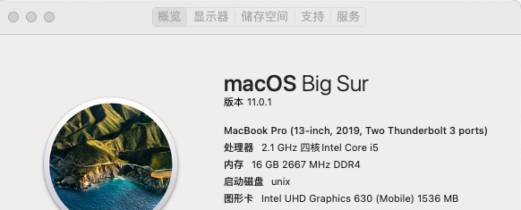

# XiaoXinPro13-1820A-BigSur
XiaoXin pro 13 i5 1820a Big Sur

## 前言

本机为小新pro13 2020 i5版本，随机自带固态为三星pm981a，已更换为SN550，网卡为1820A
## 我的安装步骤
### 1.在windows 下刷入测试版的BIOS，或通过软件修改BIOS设置
参考文献：https://derrors.cn/hackintosh/dvmt-cfglock.html  
联想小新 Pro13 的 DVMT Pre-Allocated 的默认数值为 32M，而 macOS 系统里检查 DVMT 值需要至少 64M，因此需要修改 BIOS 里 DVMT Pre-Allocated 数值    
方法1：   
通过软件修改   
方法2：  
刷入内测版BIOS，直接在开机进入的BIOS中修改

### 2.替换EFI
通过命令行或者软件，如clover configurator等软件挂载系统自带的EFI分区，将适合小新pro13的FEI文件夹替换到其中

### 3.Big Sur
经历找不到启动盘、1820A无法检测到网络、开机五国、进度条读条重启之后终于安装完成
 
